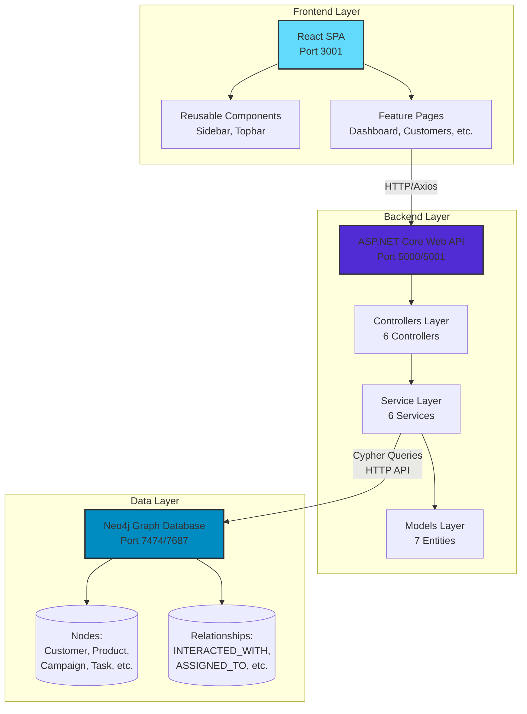
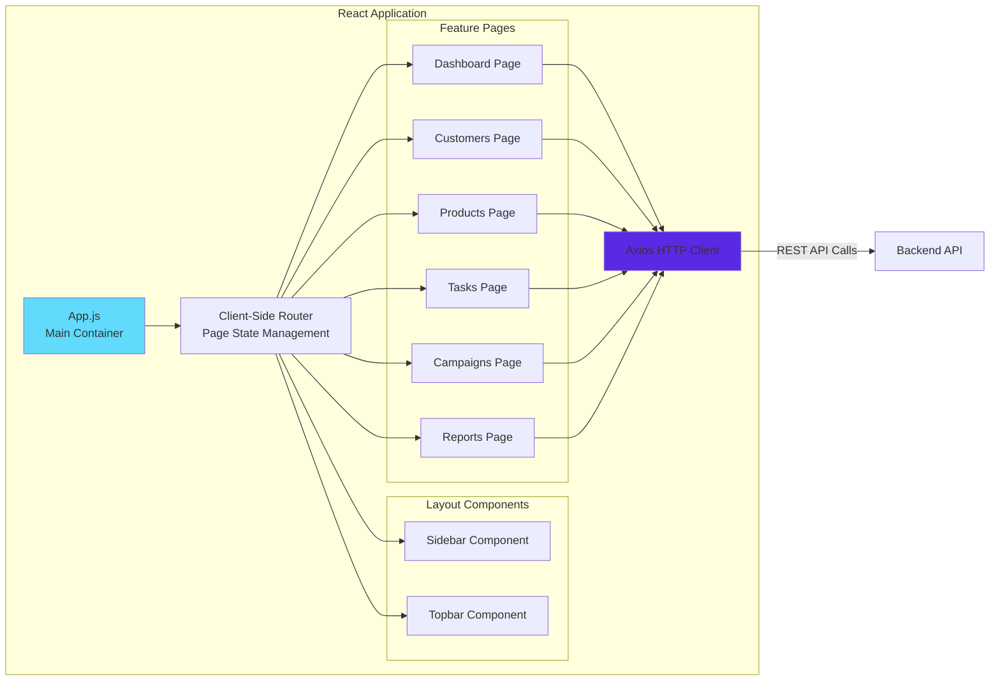
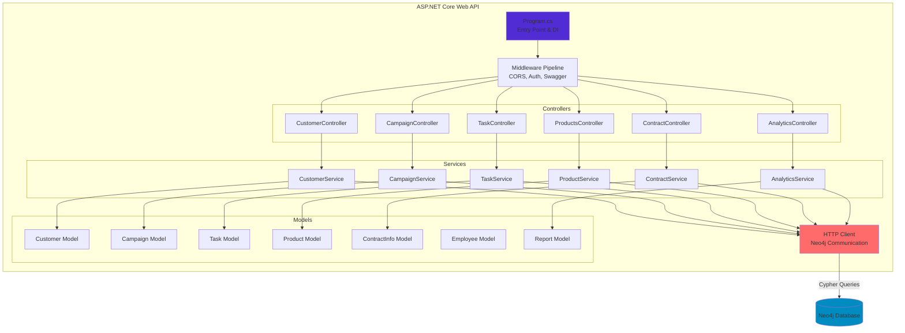
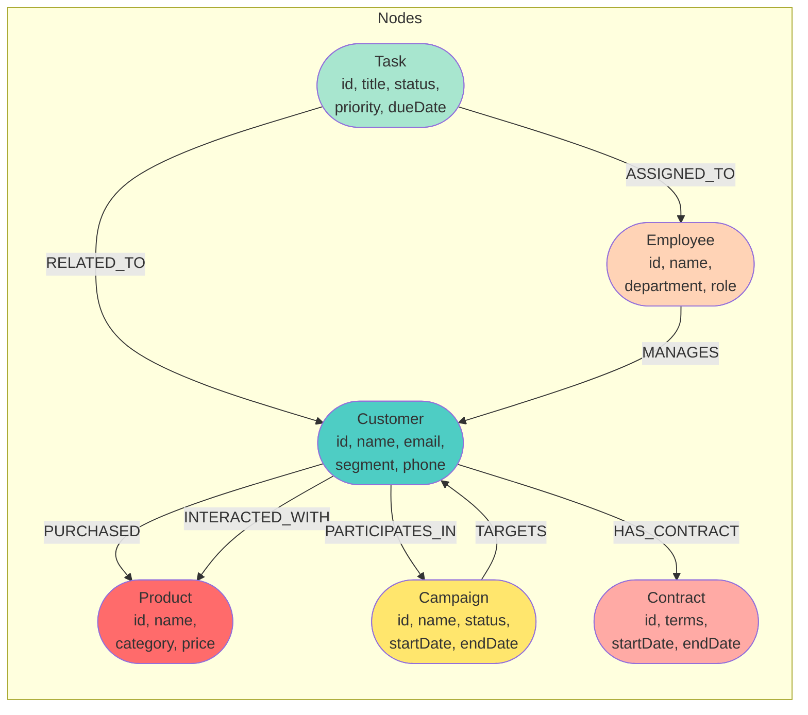
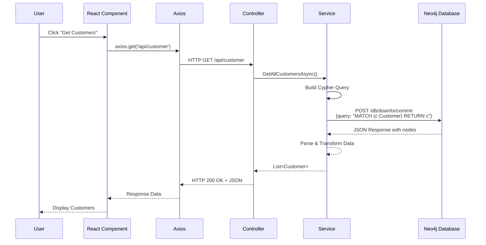
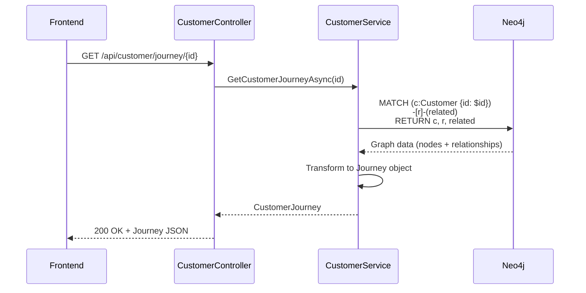
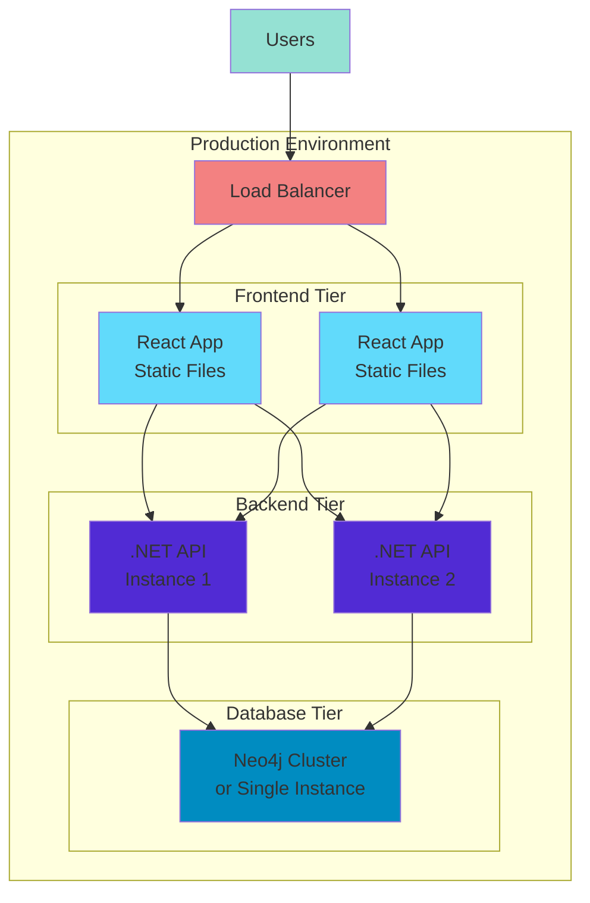

# 🏗️ DoAn_Nosql - Architecture Documentation

## System Overview

This document provides a detailed technical architecture overview of the DoAn_Nosql CRM system.

## High-Level Architecture

## Component Architecture

### Frontend Architecture

### Backend Architecture

## Data Model (Neo4j Graph)

## Request Flow

### Typical API Request Flow

### Customer Journey Query Example

## Technology Stack Details

### Backend Stack

| Layer               | Technology             | Purpose                                |
| ------------------- | ---------------------- | -------------------------------------- |
| **Framework**       | .NET 9.0               | Modern, high-performance web framework |
| **API**             | ASP.NET Core Web API   | RESTful API development                |
| **Database Driver** | Neo4j.Driver 5.28.3    | Official .NET driver for Neo4j         |
| **Serialization**   | Newtonsoft.Json 13.0.4 | JSON handling                          |
| **Documentation**   | Swagger/OpenAPI 9.0.6  | Interactive API documentation          |
| **DI Container**    | Built-in .NET DI       | Dependency injection                   |
| **HTTP Client**     | HttpClient             | Communication with Neo4j HTTP API      |

### Frontend Stack

| Layer                | Technology             | Purpose                      |
| -------------------- | ---------------------- | ---------------------------- |
| **Framework**        | React 18.3.1           | Component-based UI framework |
| **Build Tool**       | Create React App 5.0.1 | Zero-config build setup      |
| **HTTP Client**      | Axios 1.13.2           | Promise-based HTTP client    |
| **Testing**          | React Testing Library  | Component testing            |
| **State Management** | React Hooks (useState) | Local component state        |
| **Routing**          | Custom (state-based)   | Client-side page switching   |

### Database

| Component          | Technology               | Purpose                          |
| ------------------ | ------------------------ | -------------------------------- |
| **Database**       | Neo4j Graph Database     | Store entities and relationships |
| **Query Language** | Cypher                   | Graph query language             |
| **API Protocol**   | HTTP REST API            | Database communication           |
| **Ports**          | 7474 (HTTP), 7687 (Bolt) | Database access                  |

## Design Patterns

### Backend Patterns

1. **Repository Pattern** (via Services)

   - Services act as repositories
   - Encapsulate data access logic
   - Abstract Neo4j communication

2. **Dependency Injection**

   - Services injected into controllers
   - Configuration injected into services
   - Promotes loose coupling

3. **DTO Pattern**

   - Models serve as DTOs
   - Separate database representation from API contracts

4. **Async/Await Pattern**
   - All I/O operations are asynchronous
   - Improves scalability

### Frontend Patterns

1. **Component-Based Architecture**

   - Reusable UI components
   - Separation of concerns

2. **Container/Presentational Pattern**

   - Pages as containers (logic)
   - Components as presentational (UI)

3. **Hooks Pattern**
   - useState for state management
   - useEffect for side effects

## Security Considerations

> [!WARNING]
> The current implementation has several security considerations for production deployment:

1. **Database Credentials**: Stored in `appsettings.json` - should use environment variables or Azure Key Vault
2. **CORS**: Currently allows all origins (`AllowedHosts: "*"`) - should be restricted in production
3. **Authentication**: No authentication implemented - should add JWT or OAuth
4. **Authorization**: No role-based access control - should implement authorization policies
5. **HTTPS**: Should enforce HTTPS in production
6. **Input Validation**: Should add comprehensive input validation and sanitization

## Performance Considerations

1. **Database Indexing**: Ensure Neo4j indexes on frequently queried properties (e.g., `Customer.id`)
2. **Query Optimization**: Use LIMIT clauses in Cypher queries for large datasets
3. **Caching**: Consider implementing caching for frequently accessed data
4. **Connection Pooling**: HttpClient is reused (singleton pattern in services)
5. **Async Operations**: All database operations are asynchronous

## Deployment Architecture

## Development vs Production

| Aspect       | Development              | Production                                         |
| ------------ | ------------------------ | -------------------------------------------------- |
| **Frontend** | Dev server (port 3001)   | Static files served by web server                  |
| **Backend**  | Kestrel (port 5000/5001) | IIS, Nginx, or cloud hosting                       |
| **Database** | Local Neo4j instance     | Managed Neo4j (AuraDB) or self-hosted cluster      |
| **CORS**     | Allow all origins        | Specific origins only                              |
| **Logging**  | Console output           | Structured logging (Serilog, Application Insights) |
| **Secrets**  | appsettings.json         | Environment variables, Key Vault                   |

## Monitoring & Observability

Recommended additions for production:

1. **Application Performance Monitoring (APM)**

   - Application Insights
   - New Relic
   - Datadog

2. **Logging**

   - Serilog for structured logging
   - ELK Stack (Elasticsearch, Logstash, Kibana)

3. **Metrics**

   - Response times
   - Error rates
   - Database query performance

4. **Health Checks**
   - API health endpoint
   - Database connectivity check

## Scalability Considerations

1. **Horizontal Scaling**: Backend API can be scaled horizontally (multiple instances)
2. **Database Scaling**: Neo4j supports clustering for high availability
3. **Caching Layer**: Add Redis for session management and caching
4. **CDN**: Serve frontend static assets via CDN
5. **API Gateway**: Consider adding API Gateway for rate limiting and request routing

---

**Last Updated**: 2025-11-24  
**Version**: 1.0  
**Maintained By**: Development Team
